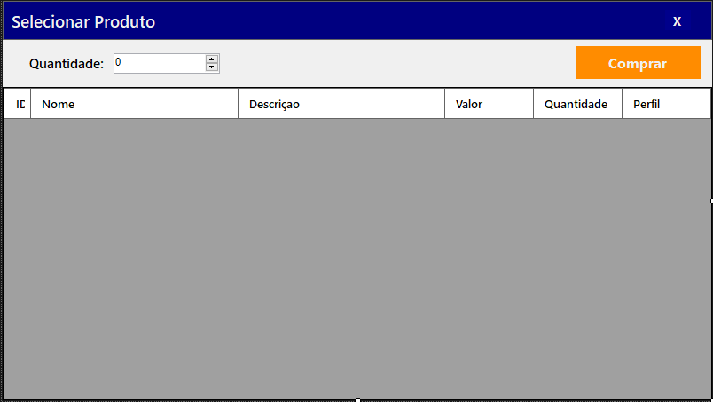

> **Status do Projeto:** Incompleto :warning:  
> **Autor:** Andre Marino Balera :busts_in_silhouette:  
> **Ano:** 2024 :date:

# :computer:

Aplicação desktop com dois níveis de acesso para gerenciamento de clientes, produtos, compras/vendas.

### 🖥️ Tecnologias e Ferramentas 

[Link para o script SQL](./Script.sql.txt)

## Tela Login 
Faça login para a aplicação funcionar de acordo com o nível de acesso do usuário 

## Tela Menu Principal
Menu principal da aplicação, difere dependendo do nível de acesso do usuário

## Tela Lista de Usuários
Tela de acesso permitido apenas para o nível ADM, onde há busca por nome, com duplo clique em uma linha ou um caminho para adicionar um novo usuário

## Tela Cadastro de Usuário
Tela de acesso permitido apenas para o nível ADM, onde insere um novo usuário ou atualiza os dados de algum usuário já cadastrado

## Tela Lista de Produtos
Tela de acesso permitido apenas para o nível ADM, onde se encontra uma listagem de todos os produtos, permitindo selecionar um produto para atualização ou a inserção de um novo produto

## Tela Cadastro de Produto
Tela de acesso permitido apenas para o nível ADM, onde insere um novo produto ou atualiza os dados (ex. quantidade) de algum produto já cadastrado. 

## Tela de Compras
Tela de acesso permitido apenas para o nível usuário comum, onde se encontra a listagem de produtos e realiza os pedidos de compras (Apenas produtos do mesmo perfil que o cliente serão exibidos)

